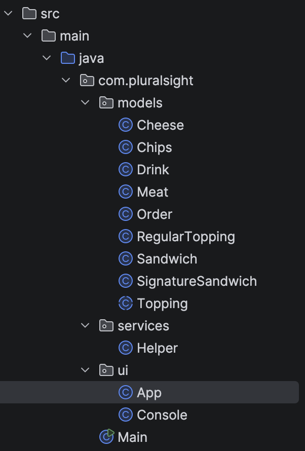

# Deli Store

## Description
This is a Java application that allows the user to create their own sandwiches, order pre-made sandwiches, 
add drinks, side, or chips. The user has the ability to edit their order and after checking out the application
generates a receipt.

## Author
Joffre Villacis

## Features
- Create custom sandwiches
- User can pick their sandwich size
- User can pick their bread and if it's toasted
- User can pick their toppings
- User can pick their sauces
- Order pre-made sandwiches and edit 
- Add drinks and chips
- Generate and save receipts to a separate folder

## Project Structure

## Future Improvement
1. start learning how to implement gui
  
## How to Run
1. Clone repository
2. Run the Main.java file
3. Follow instruction on the console
